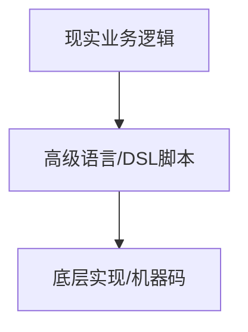

# 从函数式编程的角度解析领域特定语言的本质

> **写在前面**：我本人是一个很喜欢“深入浅出”讲东西的人。很多时候，你只需要把一个东西的底层原理讲明白了，结论往往是显而易见的

## Abstract

在许多垂直行业（如运维、通信、金融配置），我们经常会遇到各种古老或自研的DSL（领域专用语言）。在工程师的日常实践中，这些DSL往往被视作一种“操作脚本”：通过简单的命令行下发配置、驱动系统。但这种“工具化”的理解，容易掩盖它们在程序语言层面的哲学内涵。

本文尝试从**程序语言理论**与**数学建模**的角度，重新解构这些特定领域的DSL：

**本质上**：DSL与Java/C++等通用语言一样，都是关于**定义与引用**的符号系统。

**建模与语义**：

* 代码层相当于现实业务建模的**编码（Encode）**。
* 语义层则是从代码回溯业务的**解码（Decode）**。

**映射关系**：

* 原子命令 -> 标准库（Standard Library）
* 业务文档 -> 接口定义（Interface/Header）
* 代码模板 -> 三方库（Third-party Library）
* 系统状态 -> 全局上下文（Context）

**静态分析**：DSL并不需要发明新的分析体系，而是可以直接复用通用语言的方法论（AST、符号表、依赖图），差别仅在于它承载了特定领域的业务语义

我们常常抱怨DSL难用，往往是因为我们只把它当“脚本”看，而忽略了如果用IDE和静态分析的视角去构建它，它本可以是一个严谨的数学系统

## 引言：咒语与逻辑

在计算机发展的蛮荒时代，或者在某些特定系统的控制台前，如果一位工程师看见这一坨符号：

```text
CREATE RESOURCE: NAME="user_profile_01", MODE=RW, TYPE=KV_STORE;

```

他可能会想：

* 这是不是某种“召唤仪式”？
* 为什么冒号后面跟着一串咒文般的参数？
* 最后还要用分号收尾？

如果他再看到另一坨符号：

```text
DROP RESOURCE: NAME="user_profile_01";

```

或许会联想到：

* 啊，这是一种“驱逐仪式”？
* 和前面的“召唤”长得很像，但语气更简短、更冷酷。

工程师当然不会真的把它们当作咒语，他们凭借经验知道：第一条命令是“创建资源”，第二条命令是“删除资源”。但是，当他们在一行行脚本中游刃有余时，未必真的思考过：

* 为什么这些符号能这样排列组合？
* 为什么不同的命令看似孤立，却能被人类读懂为“操作设备”的行为？
* 这种语言的**内在本质**究竟是什么？

事实上，DSL的业务含义（创建/删除资源）只是表层的语义，而它在哲学上的内涵，是更接近**程序语言乃至数学的本质**——一种对“客观存在的事物及其相互作用”的抽象和建模。

这篇文章要做的，正是从**程序语言与数学**的角度，来解构DSL——去追问：在脱离具体业务背景的情况下，DSL究竟是什么？以及为什么我们完全可以用**通用程序语言的方法论（静态分析+IDE+ToolChain）**去降维打击这些看似简陋的脚本

## 程序语言本质上是一个符号系统

结论是，包括特定领域DSL在内的所有程序语言，本质上是一个关于**定义**和**引用**的符号系统：

* **定义**：规定一个符号及其内在的语义（某种形式的数据/行为）。
* **引用**：获取一个符号的语义（某种形式的数据/行为）。

更形而上学地说，如果我们把编程定义为**一些客观存在的事物之间的相互作用**，那么**引用本身就是一种声明某个事物存在的断言**，而这种存在性来自于**上文对该事物的定义**。

### 函数式编程：程序语言的本质是数学

在讨论DSL之前，我想先聊聊**函数式编程（Functional Programming, FP）**。在不少人眼里，FP只是一些Lambda、Map/Reduce之类的语法糖，但FP实际上提供了一种更接近程序本质（即数学建模）的思想。它将程序语言映射到数学空间，让我们看清：**程序语言不仅仅是语法规则的集合，而是关于确定性规则的建模艺术**

虽然C、Java甚至很多DSL在语法特性上并不FP，但我们仍能从FP的角度去解构它们。

有人可能会认为运算符（加减乘除）或命令字是一个独立的部分，但从“函数是一等公民”的角度看，它们依然是被**定义**和**引用**的：

* 当我们引用一个**变量/对象**时，其实是引用了一个/组数据。
* 当我们引用一个**函数/命令**时，则是引用了一个从数据到数据的变换规则。当我们没有调用该函数时，我们引用的实际上是**规则的内容**（即数据）。

用一个直观的代数系统类比：

* **变量 → 值**
* **对象 → 数据结构（向量空间的一个点）**
* **函数 → 变换（作用在数据上的映射）**

甚至**面向对象（OOP）**也可以在FP体系下被重新解构：

* **类（Class）**是关于模型的元数据，**对象（Object）**是模型实例的数据容器。
* **构造函数（new）**本身就是一个具有语义的函数：接受一个数据集（元数据），输出一个数据集（实例）。
* **成员方法**本质上是带有默认`self/this`参数的静态函数。

理解了这一点，就能明白为什么DSL本质上和通用语言一致：**不论是Java还是某系统的配置脚本，本质上都可以抽象为“数据 + 变换”，从而可以应用相同的静态分析方法论。**

### 建模：从现实空间到数学空间的映射变换

从这个角度出发，程序语言可以被抽象为一门**关于定义与引用数据的艺术**。DSL和通用语言一样，都是一套代数符号系统，围绕“值、向量、变换”的概念空间来组织。

你可能会问，既然本质一样，为什么用途天差地别？
这是因为我们赋予了语言不同的**语义**。在解决现实问题时，我们通常经历这样一个过程：

* **函数**：function/meta data，元规则，即本身。
* **数据**：data，function的实际input/output。
* **业务建模**：某种将现实空间映射到代数系统的函数。

进一步说：

这套公式不仅能描述DSL，也能解释程序语言中的**层次化建模与架构分层**。

**这为我们理解DSL提供了一个关键视角：如果建模让代码从现实映射到数学空间，那么语义则恰好描述了反方向——代码如何再次映射回现实**

### 语义：从数学空间到现实空间的映射变换

所谓语义，就是代码在业务层面表达的意义。这里我们需要区分**低阶语义**和**高阶语义**：

* **低阶语义**：语言本身的运作规则。例如，引用了一个未定义的变量，这是语法/编译错误，与业务无关。
* **高阶语义**：代码期望实现的业务效果。例如，这个配置下发后，系统是否按预期运行？这是强业务相关的。

有趣的是，在这个映射中：

* **业务建模**：业务 -> 代码（Encode）
* **语义分析**：代码 -> 业务（Decode）

二者是同一套映射的正反过程。

这告诉我们要如何分析DSL：**在触及具体的业务意图（高阶语义）之前，我们完全可以按照通用程序语言的方法论（IDE、编译原理）来解析DSL。只要了解了这门DSL本身是如何运作的（低阶语义），就能对其进行AST解析、构建依赖图，得到一个中间形态**，然后再从业务角度去分析它。

## DSL映射到通用程序语言

既然DSL和GPL在静态分析上同构，我们不妨把DSL的常见元素映射到我们熟悉的编程概念中。

很多特定的DSL之所以被认为“低级”或“难用”，是因为它们缺少了**高阶建模**的能力。大多数DSL命令字都是**面向低阶建模**的（直接对应具体操作），这使得这类DSL本质上像是一个**低代码平台**——它直接暴露业务原语，却缺少抽象和复用的机制。

### 1. 面向过程：配置文件即“头文件”

很多DSL场景下，工程师会有两类文件：

* **当前系统的快照/配置（Snapshot）**
* **变更脚本（Script）**

在通用语言视角下，**系统快照**本质上就是**变更脚本**的头文件（Header File）或全局上下文（Context）。工程师是在一个已知的状态（Header）基础上，编写过程式的代码（Script）来修改状态。

### 2. 字面量：参数即数据

DSL虽然可能没有显式的变量声明（`var a = 1`），但充满了数据类型（字符串、整数、枚举）。
在DSL中，我们往往直接使用字面量（Literal）来填充命令参数。这其实是DSL缺乏复用思想的体现——在通用语言中，可复用的数据会被提取为常量或变量，而在简陋的DSL中，用户不得不反复书写相同的字面量。

### 3. 标准库与三方库：命令字与模板

这是最有趣的映射。

* **DSL的原子命令（Command）**：通常由平台或系统底层定义，不可修改。这相当于通用语言的**标准库（Standard Library）或Built-in Functions**
* **脚本模板（Template/Snippet）**：工程师为了偷懒，会将常用的命令组合存成模板。这实际上就是**用户自定义函数**或**第三方库（Third-party Library）**

在成熟的语言生态中（如Python的PyPI, Node.js的npm），第三方库是标准化的、可依赖管理的。而在很多DSL生态中，"三方库"（脚本模板）往往散落在工程师的个人笔记或TXT文档里。

**DSL的演进方向，若要释放生产力，必须从“个体手工写模板”走向“模板的标准化与包管理”。**

### 4. 关键字：语法分隔符

很多人会把DSL的命令字（如`CREATE`, `ADD`）当成关键字（Keyword）。其实不对。
从编译器视角看，命令字是**函数标识符**。真正的关键字是那些分隔符（冒号、分号、等号）。
如果一门DSL允许你调用的命令成千上万，但语法结构永远是`Command: Param=Value;`，那说明这门DSL的语法及其贫瘠，但标准库极其庞大。

## 在DSL上应用通用语言的方法论

### 静态分析的核心是“索引”

既然DSL是关于定义和引用的系统，那么编译器、IDE的核心工作流程——**语法分析（AST构建）、符号表构建（索引）、引用消解（符号回填）**——完全适用。

IDE的补全和跳转，本质上就是对**索引**的引用。

* AST错误（语法报错）= 引用了不存在的元数据。
* 关键字高亮 = 识别出了语言的元变换规则。

任何面向业务的DSL，只要经过AST解析，构建出一个巨大的**定义-引用图（Definition-Reference Graph）**，就能**无二义性地描述出脚本的语义**

### 业务子图与作用域

通用语言通过**类、函数、包**来切分作用域（Scope），将巨大的引用图解耦为子图。
DSL中往往也有类似的概念，比如“网元”、“模块”、“事务组”。这恰好证明了DSL与GPL的同构性

我们完全可以：

1. **解析代码**：生成AST和引用图。
2. **语义叠加**：将业务逻辑（如：A命令必须在B命令之前）作为**Lint规则**或**图的约束条件**叠加在引用图上。

### 静态分析的本质：对代码建模

静态分析（IDE & 编译器）是对**代码本身**进行建模，而代码是对**业务**进行建模。



随着业务复杂度提升，DSL脚本的量级会迅速扩张。当脚本规模超过人脑处理的阈值时，我们就需要**针对DSL的IDE**。

这种IDE的价值在于：它既从通用语言的角度补足了代码层分析体系（语法高亮、跳转、重构），又在此基础上承载了特定领域的业务逻辑检查。这才是DSL治理的终极形态

## 总结

说了这么多，其实核心思想很简单：

1. **程序语言是一个关于数据定义与引用的符号系统**。不论是Java、Python还是简陋的DSL，本质差异在于表现形式，而非逻辑内核。
2. **建模与语义是双向映射**。建模是Encode（业务->代码），语义是Decode（代码->业务）。
3. **DSL的困境在于缺乏高阶建模**。大多DSL停留在“低代码”阶段，逼迫工程师用人脑去模拟“编译器”和“链接器”的工作。

我们将DSL还原为程序语言，不是为了炫技，而是为了**借力**。我们不需要为每一门DSL发明一套全新的分析理论，直接复用编译器前端技术和静态分析理论，配合领域特定的语义规则，就能把那些原始的“脚本”变成现代化的工程项目。

让脚本归脚本，让工程归工程。这或许就是作为工程师，对“工具”最大的尊重。