## 序言

众所周知，Macintosh系统是正黄旗的UNIX系统，这使得Mac成为了目前几乎唯一一个兼顾了**日常体验**和**开发体验**的电脑，开放的生态环境也让Macintosh像Linux一样有许多Geek在源源不断地贡献各种轮子。这是我对我自己的MacBookPro探索的一个总结

我后续也会跟进我的进度，不定期刷新该帖子

## HomeBrew-包管理器

Brew作者因为写不出二叉树旋转被Google拒之门外的故事已经耳熟能详了，HomeBrew是Macintosh的包管理器，在做其他事情前，强烈建议先安装HomeBrew，因为许多软件不仅能通过图形化界面安装（dmg/pkg），许多也可以（或者仅可以）通过`brew install`去安装

你可以在[HomeBrew的官网](https://brew.sh/)找到安装教程，但是说白了其实也就一句命令：

```zsh
/bin/bash -c "$(curl -fsSL https://raw.githubusercontent.com/Homebrew/install/HEAD/install.sh)"
```

将这个命令复制到MacOS自带的终端（或者其他你自行安装的终端软件）去运行，由于这是一个底层组件，安装过程中会需要你输入管理员密码

安装成功后，你就可以通过`brew --version`查看当前的HomeBrew的版本了


### brew-cask

要注意的是，如果你要安装具有图形化UI的软件，需要带上`--cask`参数，如`brew install --cask ghostty`，该参数等价于你用dmg/pkg去安装程序，会将程序注册到**应用/启动台**里，带cask与不带cask的仓库也是不一样的（因为一开始本来就是两个软件，后来合并到一起了）

## 资源库

建议开启Home目录下的隐藏文件夹**资源库/Library**，大部分应用的源文件都在这里，许多配置文件也是存储在这里的（如Ghostty和Rime），如果不能找到资源库的话，哪怕应用给出了入口，找到并编辑这些配置文件也会比较麻烦

打开**访达/Finder**，在左侧的侧边栏找到你的Home目录（应该是你的用户名），进去后在空白区域右键，点击**查看显示选项**

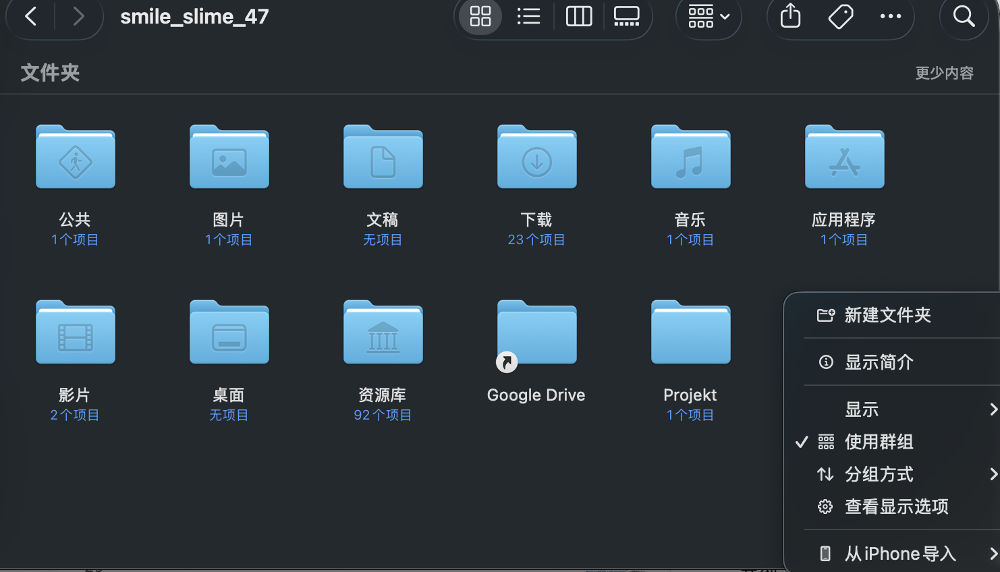

选中**显示“资源库”文件夹**后保存

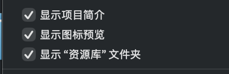

## Ghostty-终端

用过KDE的人应该都对它的下拉式终端**Yakuake**印象深刻，MacOS本身的终端软件虽然够用，但定制化这块多少差点意思，没办法满足Geek的探索欲

之前MacOS便有iterm2这种老牌的终端软件（然而目前iterm2也没有中文），而且iterm2本身也比较老了

探索其他的终端软件时，无意中发现了Anthropic官方推荐运行Claude Code的终端**Ghostty**，这个软件胜在极高的渲染性能和轻量化的架构，可以毫无压力地渲染Claude Code这种需要高频流式渲染的场景

你可以看到Ghostty极具geek风的官网

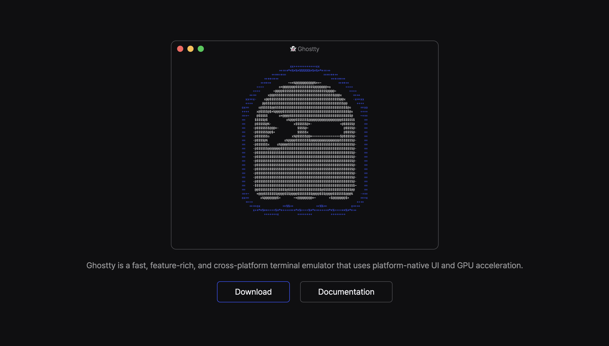

通过download下载dmg，或者直接在终端运行`brew install --cask ghostty`，随后你便应当能够在应用里看到Ghostty

### 配置

[Ghostty配置文档](https://ghostty.org/docs/config/reference)

Ghostty遵循**零配置哲学**，不需要进行任何配置即可直接使用终端，但是和其他主流终端软件不同的是，Ghostty的绝大多数配置都需要通过yaml配置文件（**config.ghostty**）来配置，并没有一个可视化化的配置界面

在左上角菜单栏`Ghostty->Settings`打开配置文件，这里是一个我在知乎找到的[配置教程](https://zhuanlan.zhihu.com/p/2016625071427428917)，当然我并没有配置太多的东西，只配置了一些我需要的内容

如果你在上文中开启了资源库，你应当能在`~/Library/Application Support/com.mitchellh.ghostty/config.ghostty`找到该文件

#### 字体
```conf
font-family = JetBrainsMono Nerd Font
font-family = PingFang SC
```

JetbrainsMono懂的都懂，最好用的等宽字体之一
- [官网/下载地址](https://www.jetbrains.com/lp/mono/)

但是这里我安装的是Nerd Font，Nerd Font是在某个字体的基础上，额外添加了一套图标库，用于开发者在终端等场景下渲染，这里我也是为了兼容后面要安装的Starship

可以直接在brew安装Jetbrains Mono的Nerd Font

```zsh
brew install --cask font-jetbrains-mono-nerd-font
```

然后加上苹方黑体，防止无法正常渲染中文字库

#### 样式

```conf
theme = light:Monokai Pro Light,dark:Monokai Pro Octagon
```

theme字段用于配置Ghostty的主题，在任意终端输入`ghostty +list-themes`可以查看当前所有可用主题，以及预览每个主题的应用效果

theme字段的格式为`light:<主题名>,dark:<主题名>`

```conf
shell-integration-features = no-cursor
cursor-style = bar
cursor-style-blink = true
```

sh集成会导致这里修改光标样式无法生效，需要加上`shell-integration-features = no-cursor
`禁用sh集成的光标，后面就是简单的**块状光标**和**光标闪烁**了

```conf
quick-terminal-position = top
quick-terminal-screen = mouse
```

这里设置了快速终端置于顶部，模拟出了**Yakuake**那种下拉式终端的效果（注意Ghostty本身默认叫带有呼出动画，因此能够模拟出那种下拉的效果）

第二行则是指定了按下快捷键时，下拉终端默认从哪个显示器出现，这里设置为了光标所在的显示器

```conf
macos-hidden = always
```

最后这一行则是隐藏Ghostty在Dock栏的图标，因为这基本上算一个常驻软件（尤其是要考虑到要维持下拉终端），加上大部分人一般不会通过图标（一般是快捷键或者其他方式）去启动终端，因此在Dock栏再放一个Ghostty的图标就显得有些多余了

#### 热键

```conf
keybind = global:ctrl+space=toggle_quick_terminal
```
Ghostty的热键的格式是**作用域:键位组合(+号分割)=动作**，具体的内容需要查看配置文档的[Key Bindings](https://ghostty.org/docs/config/keybind)一节

这里我设置了ctrl+空格呼出快速终端，主要是因为option+空格我给Gemini了，Command+空格是Spotlight，所以这里留下了Ctrl+空格给终端

#### 语言

你可能会注意到，官方文档中给出了language配置项，可以IETF语言标签来指定显示语言，但是这个功能是**1.3.0**才上线的，而我在写这篇文章的时候，Ghostty的版本也只更新到了**1.3.1**，可以在[更新日志](https://ghostty.org/docs/install/release-notes/1-3-0)里看到，目前支持的本地化语言也只有这么几项

- Croatian
- Kazakh
- Latvian
- Lithuanian
- Spanish (as spoken in Spain)
- Vietnamese

短期内使用上简体中文的概率应该是不大了，不过好在Ghostty把绝大多数配置都写在yaml里了，有没有中文其实意义也不大...

#### 使配置生效

配置好`config.ghostty`后，在左上角`Ghostty->Reload Configuration`使配置生效，注意这里必须是应用里打开的Ghostty，**快速终端是没有菜单栏的**

## Zsh-Shell集成

和许多Linux发行版不同，MacOS的终端默认shell是**Zsh**而不是**Bash**，我们并不需要手动安装Zsh，但是这方面想要定制化的可以直接去参考著名的[**OhMyZsh**](https://github.com/ohmyzsh/ohmyzsh)，熟手可以直接跳过这一章了

### 高亮和补全

不论如何，一个具有良好高亮和补全功能的Shell肯定是必要的，可以安装**zsh-syntax-highlighting**和**zsh-suggestions**

```zsh
# 安装
brew install zsh-syntax-highlighting
# 写入zsh的配置文件
echo "source $(brew --prefix)/share/zsh-syntax-highlighting/zsh-syntax-highlighting.zsh" >> ~/.zshrc
# 使配置生效
source ~/.zshrc
```

同理，安装zsh-suggestions

```zsh
# 安装
brew install zsh-autosuggestions

# 写入zsh的配置文件
echo "source $(brew --prefix)/share/zsh-autosuggestions/zsh-autosuggestions.zsh" >> ~/.zshrc

# 使配置生效
source ~/.zshrc
```

### Starship-Shell Prompt

高亮有了，但是你大概还是会觉得左侧的Shell Prompt（就是**用户名@主机名**那一坨）还是太丑了，可以安装其他的Shell Prompt软件，这里我选择的是starship

使用`curl -sS https://starship.rs/install.sh | sh`或者`brew install starship`安装Starship

安装完成后，写入zsh的配置文件并使配置生效

```zsh
echo 'eval "$(starship init zsh)"' >> ~/.zshrc
source ~/.zshrc
```

然后你就能看到新的极简的Shell了

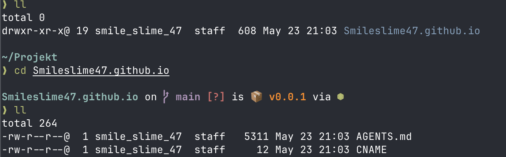

### 别名

平时习惯用ll了，但是zsh默认没有设置ll的别名，所以可以再手动设置一下

```zsh
echo "alias ll='ls -lG'" >> ~/.zshrc
source ~/.zshrc
```
## 输入法

众所周知，苹果原生输入法的词库和联想一直都比较一言难尽，但是又不希望用搜狗、微信输入法这些闭源的**大而丑**的输入法

### 中州韵-输入法引擎

用过Linux的人肯定了解**中州韵（Rime）**，这是一个开源的输入法内核，在Windows、Linux、MacOS上都有支持

要注意的是，和Clash一样，中州韵本身只是内核，还需要上层的前端来将其渲染和注册到系统等，**小狼毫（Weasel）**和**Fcitx5**恰好就是中州韵在**Windows**和**Linux**的前端，而对于MacOS，RIME的前端是**鼠须管（Squirrel）**

### 鼠须管-输入法前端

[鼠须管官方仓库](https://github.com/rime/squirrel)

可以直接通过brew安装鼠须管，鼠须管内置了中州韵内核，因此无须再重复安装中州韵

```zsh
brew install --cask squirrel
```

随后点击右上角的状态栏的输入法图标，点击**打开键盘设置**，点击左下角的+号添加新的输入法

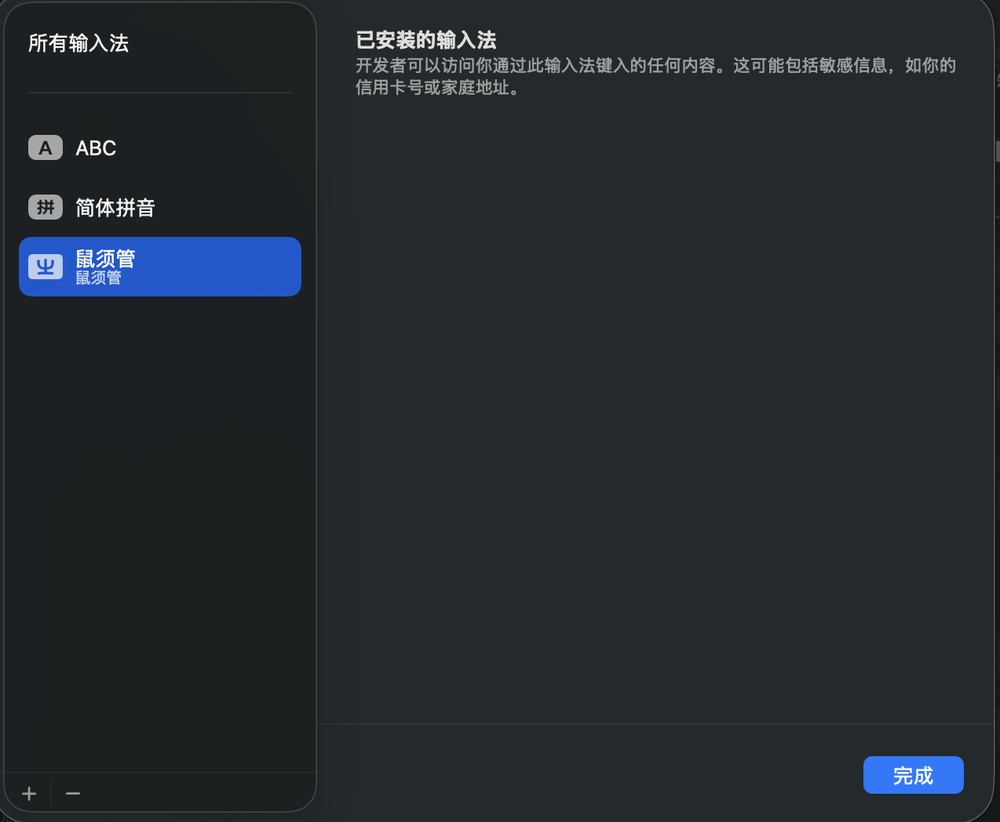

在简体中文处，找到鼠须管，并点击添加

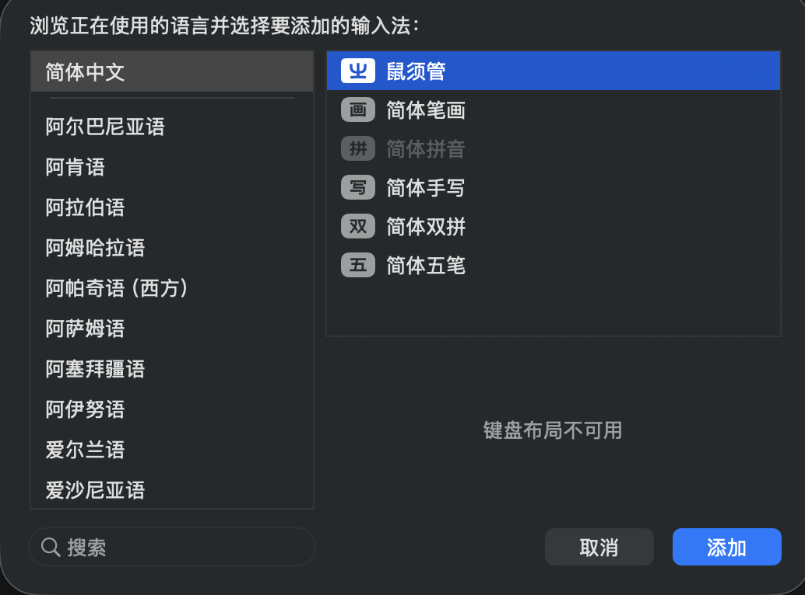

### 雾凇拼音-简中词库&配置预设

[雾凇拼音官方仓库](https://github.com/iDvel/rime-ice)

安装鼠须管后，你大概会发现候选词几乎都是**繁体中文**（如果你看过github仓库也大概发现了，因为README就是繁体中文写的），**雾凇拼音**是一个开箱即用的**简体中文词库+配置项预设**

RIME的词库和配置项都在`~/Library/Rime`这个文件夹下，你可以直接通过[仓库的release链接](https://github.com/iDvel/rime-ice/releases/latest/download/full.zip)下载雾凇拼音的配置包，删除`~/Library/Rime`下的所有文件后，将压缩包的内容解压到该目录下

另一个办法是，直接删除Rime目录，然后在`~/Library`目录打开终端，运行`git clone https://github.com/iDvel/rime-ice.git Rime --depth 1`，即可在资源库创建Rime目录并将雾凇拼音的git仓库内容拉到该目录下，这么做的优势是以后你可以直接通过`git pull`更新词库

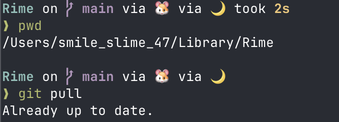

覆盖好内容后，在状态栏的输入法图标处，切换到鼠须管，然后点击**重新部署**按钮，即可使更改生效

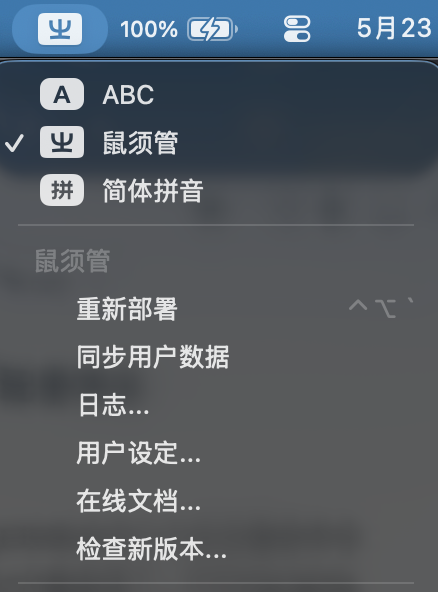

### 配置

如上文所说，中州韵、鼠须管和雾凇的配置项都在`~/Library/Rime`这个文件夹下，以`xxxx.yaml`的格式表示

虽然你可以直接修改yaml文件本身，但是强烈不建议这么做，因为这样会导致你后面更新词库和配置的时候，你自己的改动也会被覆写回去

推荐的做法是创建custom文件，具体地，对于配置文件`abcd.yaml`的配置项

```yaml
a:
  b:
    c:5
  d:
    e:10
```

你要创建一个`abcd.custom.yaml`文件（注意，这里custom.yaml之前的部分，必须和原始的配置文件名一致，否则配置不会生效），然后写入这样的内容

```yaml
patch:
  "a/b/c":10
  "a/d/e":12
```

我没有改太多东西，以下是我简单的一些配置项

```yaml
# default.custom.yaml
patch:
  "menu/page_size": 7
```

该配置项将一页的候选词数量修改为7个

```yaml
# squirrel.custom.yaml
patch:
  "style/candidate_list_layout": linear
```

该配置项将候选栏从竖向排列，修改为更加主流的横向排列

同样地，修改后需要通过重新部署来使配置生效

## 快速操作

MacOS对于右键菜单的控制比较严格，不太像Windows那样可以简单的加一堆右键菜单项上去，当然你可以用**超级右键**这种软件解决问题，但是这个小甜点其实我实在是不太想花钱解决，不过还是有很多办法可以实现效果的

### 快速操作-通过XX打开某文件/文件夹

首先是如何在**右键一个文件或文件夹时，使用VSCode或者Ghostty打开对象**，在应用搜索并打开**自动操作**，然后点击**快速操作**，如下配置，本质上都是在访达右键了文件或文件夹时，执行指定操作

具体的操作可以在左侧的操作列表搜索找到

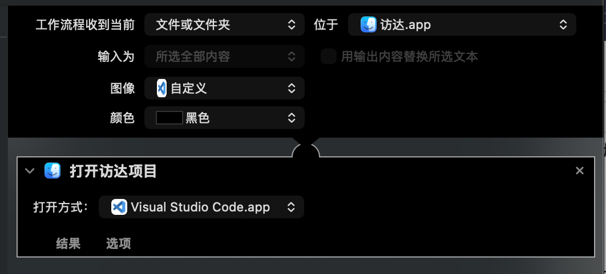

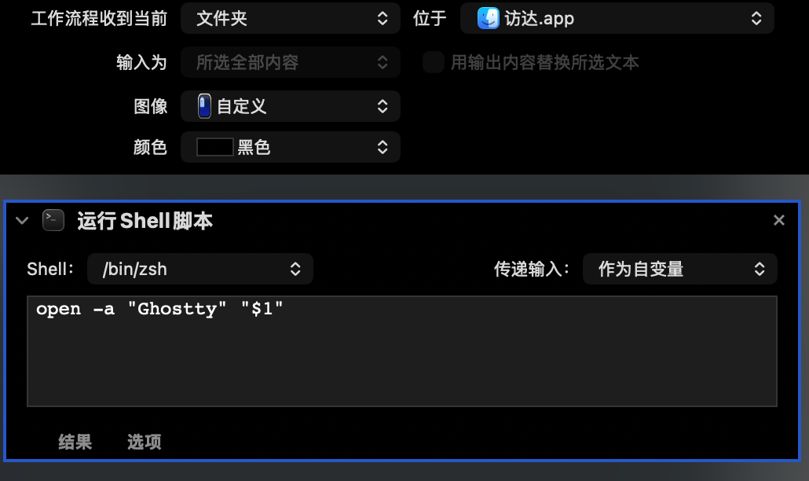

要注意的是，配置Ghostty的时候，要配置**输入作为自变量**，才能把对象传递到命令里

另外，我也会希望能够在任意地方框选文本时，能自动打开Chrome并使用谷歌进行搜索

Chrome本身虽然支持跳转到Google搜索，但是必须是在浏览器内框选的文本才可以；而MacOS虽然默认提供了这样的右键功能，但是无奈只能切换搜索引擎（依附于Safari的默认搜索引擎），但是浏览器是绑定Safari的，不和你当前的默认浏览器有关

所以我也做了一个这样的快速操作

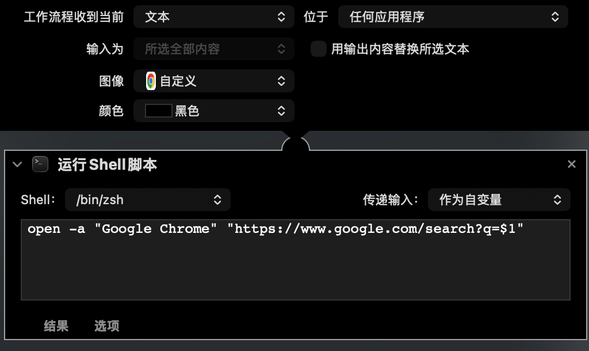

保存并命名后，你将可以在特定场景的右键菜单下看到对应的快速操作了（图为我的Gemini客户端，你可以看到第一个**使用“Google”搜索**是MacOS原生的，使用Safari的操作）

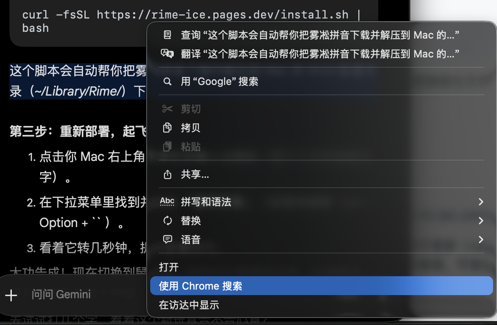

#### 管理和删除快速操作

快速操作创建完后，没办法直接在自动操作里管理，但是你保存的快速操作都会存储在`~/Library/Services`目录下，你可以直接双击对应文件来重新编辑内容，也可以直接删除文件来移除对应的右键菜单项

### OpenInTerminal-通过XX打开当前文件夹

解决了**右键文件或文件夹**使，以某个软件打开对象的问题后，我还希望能在已经进了某个文件夹后，通过右键空白区来**以当前文件夹打开终端或VSCode**，但是目前似乎快速操作也无法支持该功能（因为右键空白区时，并没有任何对象作为输入）

但是有另一个曲线救国的方案，就是**OpenInTerminal**（之前有一个更老的软件FinderGo，但是该软件已经EOM了，所以不再考虑），该软件会在右上角常驻一个状态栏图标，当你通过它的下拉图标打开软件时，则会默认以当前访达的目录作为路径打开

直接通过brew安装，然后在应用里打开该软件

```zsh
brew install --cask openinterminal-lite
```

这里我勾选了开机自启，并将默认终端和编辑器分别设置为了**Ghostty**和**VSCode**

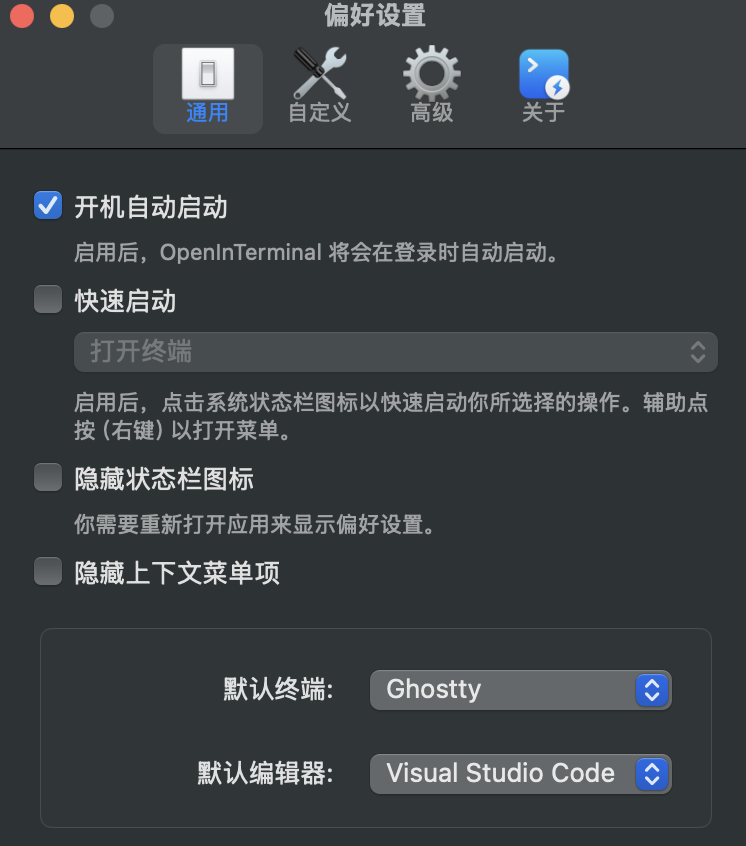

随后在**自定义**处的自定义菜单选项，加上Ghostty和VSCode

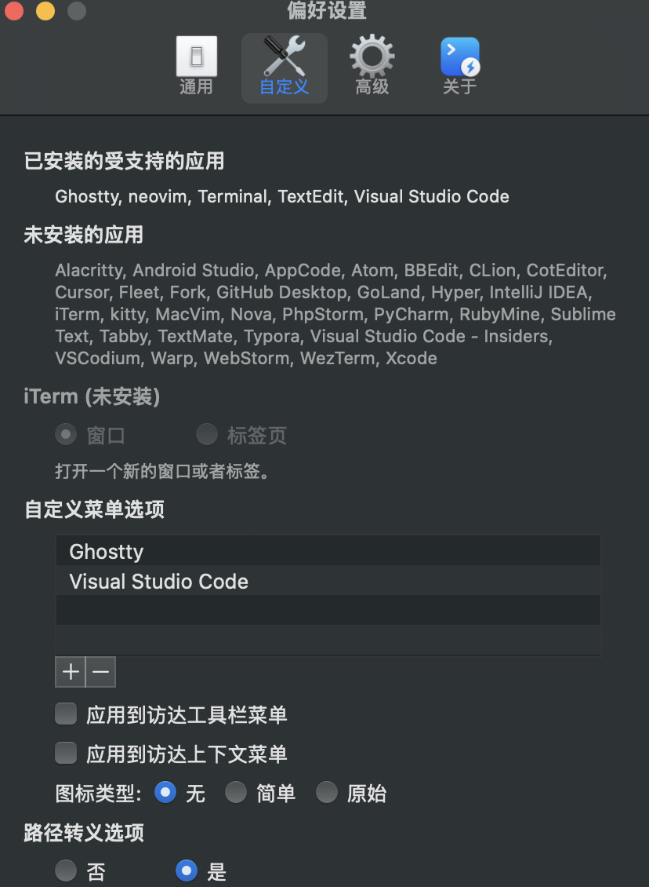

随后，你便可以在访达打开了某个工作区目录后，点击右上角的图标，以当前目录为工作区打开终端或编辑器

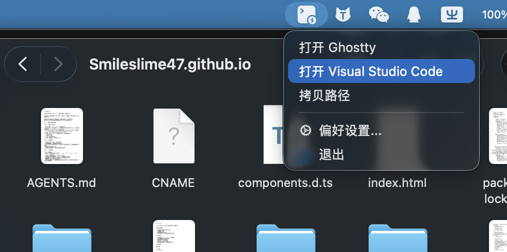

## CrossOver-兼容层

首先毋庸置疑的一点是，在大部分情况下，你都不应当也没必要在Macintosh系统上运行Windows程序（如果你持反对意见的话，大概率Mac并不适合你），但是我们仍然在少数情况下需要运行Windows程序（对我而言，我想在Macintosh上运行一部分非3A的游戏，对于MacBook Pro来说并不存在性能问题，也能在外出的时候能让我玩到游戏）

可以参考我的电脑配置是MacBook Pro(Μ5 Pro 48G)，要注意在过低配置的Mac上通过CrossOver玩游戏可能不会有太好的表现

要想在Macintosh上运行Windows程序，尤其是运行Windows游戏，需要经过三层兼容层

- **指令集**：将x86指令集翻译为Arm指令集
  - 在Macintosh，苹果官方推出了**Rosetta2**负责这一步操作，和传统的指令集翻译不同的是，Rosetta2是一套软硬件协同的系统，M系列芯片专门有一套独立的电路模型用来支持Rosetta2的x86内存模型，因此对于苹果系统，指令集翻译的成本是极低的
- **图形API**：将DirectX接口翻译为Metal接口
  - 对于Linux，DXVK+VKD3D-Proton负责了这部分工作，将将DirectX转译为Vulkan接口，由于二者架构相似，Proton可以实现几乎和原生Windows同等的性能
  - 对于Macintosh，苹果推出了GPTK来完成这部分工作，但是由于二者架构差异较大、缺失Proton那样的开源生态、苹果本身并不上心（GPTK只是一个开发者工具，苹果更希望开发者去手动适配MacOS而非用GPTK）等等一系列要素，GPTK本身会带来较大的性能损耗
- **系统API**：将Windows的系统接口翻译为Unix/Linux的系统接口
  - 对于这部分工作，不论是Macintosh还是Linux，都是基于Wine来实现的

知道了以上的信息后，如果你还确定你有类似的需求，那么可以继续了解下面的内容

之前有免费开源的Whisky也能实现一样的功能，但是由于Whisky本身的内核和CrossOver一样都是基于Wine的，加上CrossOver的开发团队恰好和Wine的开发团队是同一批人，作者认为不利于支持底层开发者，于是也EOM了，这里不再考虑

CrossOver本身只有收费版（免费版仅提供14天试用期），因此也需要先考虑好是否认为这个价格值得

### 下载

在[下载界面](https://www.codeweavers.com/crossover/download)填写相关信息后可以下载试用版客户端

### 配置容器

CrossOver需要配置容器让程序运行在模拟环境下（注意并不是虚拟机），对于大部分主流应用，CrossOver也提供了开箱即用的预设，Steam也在其中

如果你要安装的程序是预设里没有的，那么你需要在右上角点击**安装一个不在列表里的应用程序**，但是由于系统版本、运行环境等一系列都要自己来声明，相对使用门槛会高一些，这里不再赘述

如果选择了Steam的预设，CrossOver会自动在初始化过程中安装依赖运行时环境，会和Windows一样有安装引导界面，需要你手动点击下一步来推进进度，否则CrossOver的初始化进度会停滞

在安装完所有的环境和Steam本体后，容器就初始化完成了

### 显示设置

刚进入steam的时候你会发现画面比较糊，这是因为画面的DPI只有96的原因，但是这里并**不建议直接在CrossOver的Wine设置里拉高DPI或者开启高分辨率模式**，这会极大地增加输入的延迟

更推荐的做法是进入游戏后，再在游戏的画面设置里调高分辨率

### 实测效果

为了测试延迟，打了一把晕晕电波症，可见即便是运行在CrossOver下，我也仍然能打出98.90%的ACC（考虑到我本人是4K苦手+一个月没有打+MacBook Pro的键盘手感本身将不合适）

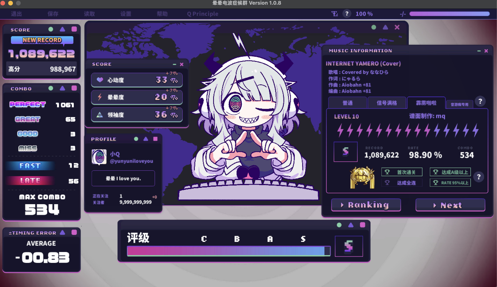

可见，在CrossOver上运行一些非3A的游戏还是绰绰有余的

## 其他

这里放一些不需要大篇幅描述的软件，但仍然算是我的一部分踩坑经验

### 切窗软件

[AltTab官方仓库](https://github.com/lwouis/alt-tab-macos)

MacOS原生的切换窗口（也就是Cmd+Tab）并不好用，只能看到应用图标，这里我比较推荐AltTab，这个软件可以实现**带应用名和应用图标**、**能看到窗口的预览图**、**可以聚焦当前查看的窗口**的切屏，只需要在设置里将快捷键同样设置为Cmd+Tab即可替换原声的切换窗口

唯一的问题是该软件有许多附加功能需要开通Pro会员，但是我看了一眼大部分是无关紧要的功能，上面我提到的均是免费版即支持的，本身也是开源软件，因此也还可以接受


### 搜索软件

我看了很多搜索软件，包括比较出名的Raycast，但是这些都带了太多捆绑收费的项目，加上Spotlight对我来说还够用，暂时不太想考虑